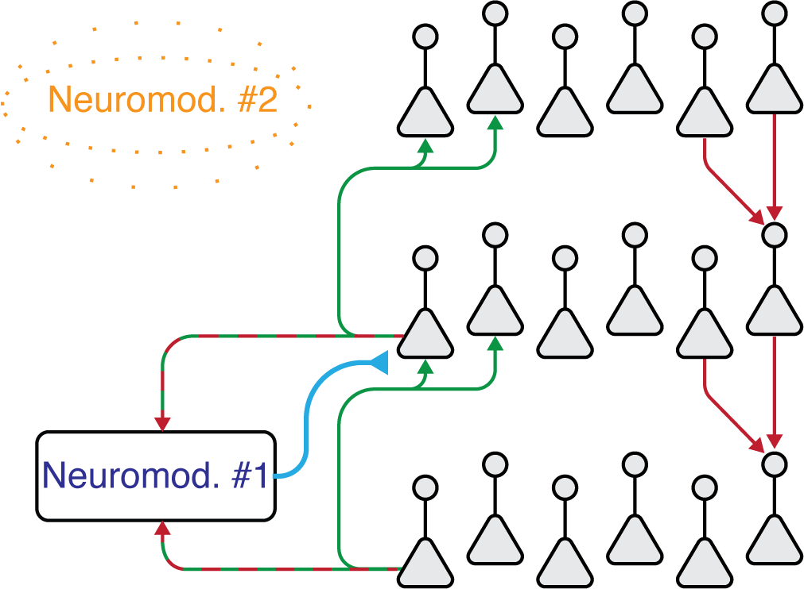

# Adversarial Wake-Sleep

This repository accompanies **An adversarial algorithm for variational inference with a new role for acetylcholine** https://arxiv.org/abs/2006.10811. It is a pytorch implementation of the adversarial wake-sleep algorithm. This is a hypothesis for learning in biological circuits:



A biological implementation of the adversarial wake-sleep algorithm. During the ‘Wake’ phase, feedforward connections drive somatic activity. Feedback connections
synapse on a segregated dendritic compartment and their synapses
change so the compartment better predicts somatic activity. Connections to the wake/sleep discriminator (Neuromod. #1, putatively
ACh) change to increase its activity, and Neuromod. #1 is projected
back to gate feedforward plasticity. During ‘Sleep’, feedback connections drive somatic activity, and the wake/sleep discriminator
tries to decrease its activity. The scheme requires a second neuromodulator (#2) released in ‘Sleep’ that controls whether feedforward
or feedback connections drive somatic activity.


Generating images on a DCGAN architecture with Adversarial Wake-Sleep. A) Basic
architecture. Images are passed up, or noise is passed down, the convolutional architecture. Dense
2-layer wake-sleep discriminators read out from pairs of layers in either stage. Optionally, generated
images can be passed up and a readout discriminator estimates whether the top layer was induced
by a real or generated image (Section 4.2) B) MNIST digits generated by standard Adversarial
Wake-Sleep, in which generative connections learn only by maximizing the likelihood of lower-level
inference activations. C) Adding the readout discriminator allows much better generation. Here the
GAN/VI interpolation parameter was set to γ = 0.999. D) CIFAR-10 generation with γ = 0.9.


## Requirements

This repo requires pytorch v1.3 or greater. To install requirements in a new Conda environment run

```setup
conda env create --file requirements.yaml
```

## Training

### Adversarial Wake-Sleep

To train a DCGAN-style architecture with pure Adversarial Wake-Sleep to generate MNIST digits as in the paper, run this command:

```train
python train.py --dataset mnist --data [PATH-TO-MNIST] --image-size 32 --epochs 30 --n-filters 32 --noise-dim 40 --lr-g 0.00001 --lr-d 0.0001 --lr-e 0.0003 --beta1 0.64  --beta2 .999 --lamda .9 --kl-from-sn --divisive-normalization True --save-imgs
```

This is the hyperparameter setting used in the paper.

### Doubly Adversarial Wake-Sleep

We can force the inference network to doubly act as a discriminator on images by setting `gamma` less than 1. `gamma=0` is a standard WGAN-GP.
Here on MNIST
```train
python train.py --dataset mnist --data [PATH-TO-MNIST] -b 128 --image-size 32 --epochs 100 --n-filters 32 --noise-dim 40 --lr-g 0.0002 --lr-d 0.00001 --lr-e 0.0008 --lr-rd 0.00001 --beta1 0  --beta2 .9 --lamda .7 --lamda2 7 --kl-from-sn --divisive-normalization True --save-imgs --gamma 0.9```
```
or CIFAR-10
```train
python train.py --dataset cifar10 --data [PATH-TO-CIFAR10] -b 128 --image-size 32 --epochs 200 --n-filters 128 --noise-dim 100 --lr-g 0.0002 --lr-d 0.00001 --lr-e 0.0008 --lr-rd 0.00001 --beta1 0  --beta2 .9 --lamda .7 --lamda2 7 --kl-from-sn --divisive-normalization True --save-imgs --gamma 0.9```
```
## Evaluation:

To save a batch of 10,000 generated images (for evaluating the FID score using code from e.g. [TTUR](https://github.com/bioinf-jku/TTUR)), run this command:

```eval
python generate_and_save_imgs.py --dataset cifar10 --path [PATH-TO-MODEL-CHECKPOINT] --image-size 32 --n-filters 128 --noise-dim 100 --divisive-normalization
```
This loads a checkpoint with the specified architecture. Make sure to ensure this architecture is the same.

To get the linear separability of classes layers, call this command to load a model and run a linear SVM (requires scikit-learn):
```
python SVM_classify_from_model.py --dataset cifar10 --path [PATH-TO-MODEL-CHECKPOINT] --data [PATH-TO-CIFAR] -b 512 --image-size 32 --n-filters 128 --noise-dim 100 --divisive-normalization --n-folds 10 --alpha 0.0001 --epochs 5
```
